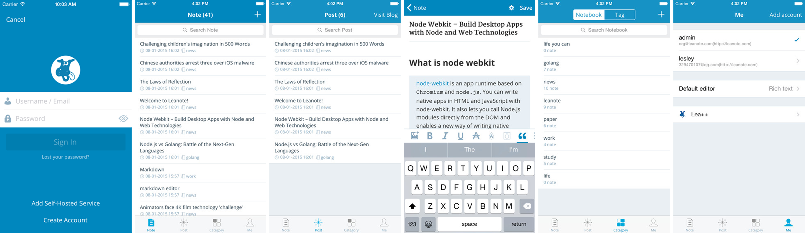

# Leanote IOS

[](https://gitter.im/leanote/leanote-ios?utm_source=badge&utm_medium=badge&utm_campaign=pr-badge&utm_content=badge)

<a href="https://itunes.apple.com/cn/app/leanote/id1022302858?mt=8" title="Download From App Store" class="ios-download">
    
</a>

## 1. Building

### 1.1. Pod install third party libraries

Leanote for iOS uses Cocoapods (http://cocoapods.org/) to manage third party libraries. 

Run `pod install` from the command line to install dependencies for the project.

*The current version of CocoaPods is recommended.*

### 1.2. Run On Xcode

Launch the workspace by either double clicking on Leanote.xcworkspace file, or launch Xcode and choose File > Open and browse to Leanote.xcworkspace.

## 2. Support & Join us

* Email: leanote@leanote.com
* [Leanote BBS](http://bbs.leanote.com)
* [Leanote Google Group](https://groups.google.com/forum/#!forum/leanote)
* QQ Group: 256076853, 158716820

## 3. Preview



## 4. Acknowledgement

* [WordPress-iOS](https://github.com/wordpress-mobile/WordPress-iOS)
* [WPMediaPicker](https://github.com/wordpress-mobile/MediaPicker-iOS)
* [AFNetworking](https://github.com/AFNetworking/AFNetworking)
* [SWTableViewCell](https://github.com/CEWendel/SWTableViewCell)
* [ZSSRichTextEditor](https://github.com/nnhubbard/ZSSRichTextEditor)

## 5. LICENSE

[LICENSE](https://github.com/leanote/leanote-ios/blob/master/LICENSE)

```
LEANOTE - NOT JUST A NOTEPAD!

Copyright 2015 by the contributors.

This program is free software; you can redistribute it and/or modify
it under the terms of the GNU General Public License as published by
the Free Software Foundation; either version 2 of the License, or
(at your option) any later version.

This program is distributed in the hope that it will be useful,
but WITHOUT ANY WARRANTY; without even the implied warranty of
MERCHANTABILITY or FITNESS FOR A PARTICULAR PURPOSE.  See the
GNU General Public License for more details.

Leanote IOS is licensed under the GPL v2.
```
